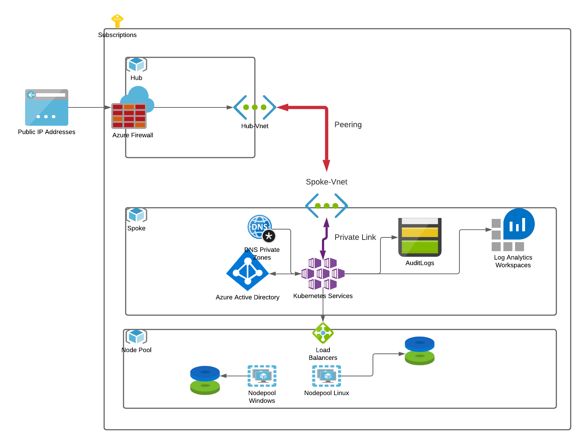

# TF_k8s_Azure

## Description:
This repository is used to create a hub and spoke type AKS architecture. The cluster is completely private. It is created in a virtual network protected by a firewall.

The following diagram shows the implementation made in this repository:

## Requirement :

> terragrunt version v0.29.6
> Terraform v0.14.9